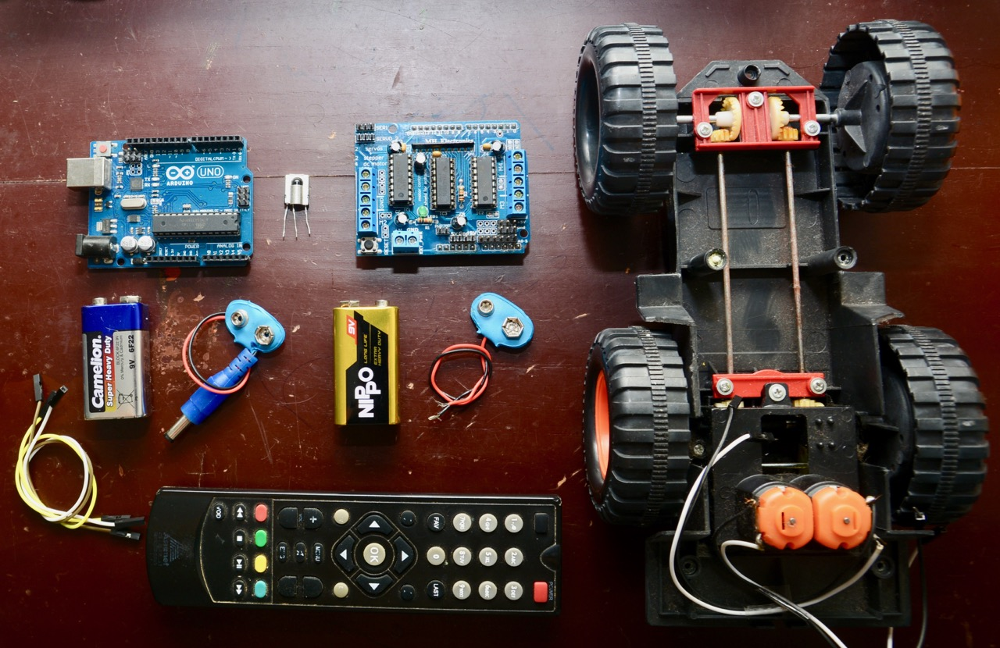
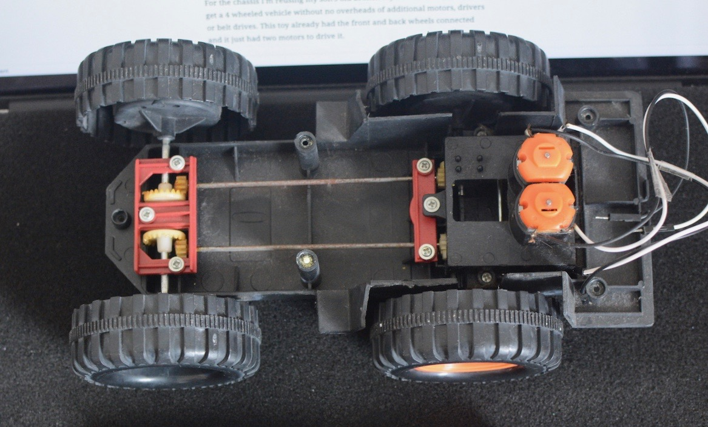
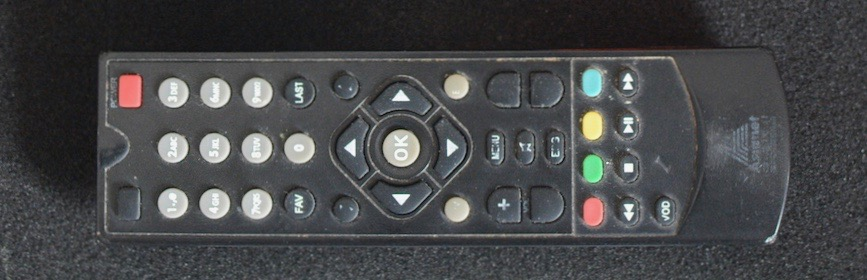

# TV-remote controlled car using Arduino
A simple Arduino based project to control a car using an old TV remote control. I ain’t a core electronics person but more of a tinkerer. Thus the below setup is to just get it working. Follow at your own risk!
<p align="center">
    
</p>

### Bill of materials
| Sl no | Item                   | Model  | Quantity |
|-------|------------------------|--------|----------|
| 1     | Arduino                | UNO R3 | 1        |
| 2     | Serial IR receiver     | HL29   | 1        |
| 3     | Motor driver shield    | L293D  | 1        |
| 4     | 5V DC motor            |        | 2        |
| 5     | Jumper wires           |        | ~ 10     |
| 6     | 9V Battery             |        | 2        |
| 7     | Battery snap connector |        | 2        |
| 8     | Car chassis            |        | 1        |

### Hardware and wiring
For the chassis I’m reusing my son’s old broken toy bulldozer. That helped get a 4 wheeled vehicle without no overheads of additional motors, drivers or belt drives. This toy already had the front and back wheels connected and it just had two motors to drive it.
<p align="center">
    
</p>

Wiring is pretty simple.
* Motor shield attaches to the Arduino
* Used motor interfaces 3 and 4 on the motor shield
* IR receiver connected to pin A5
* Arduino and Motor shield powered by two separate 9V batteries

### Software
The software part is also pretty simple. We just need to read the input from IR and convert it to an appropriate speed for each of the motors.

### IR interface and remote control (TV remote)
* First step is to pick four keys on the remote (FORWARD, BACKWARD, LEFT TURN, RIGHT TURN) to drive the vehicle. My TV remote had a directional set of keys so I picked those keys.
<p align="center">
    
</p>

* Now find the serial codes for those keys. For that wire the IR receiver to the Arduino and write a sample code (as below) to log the received codes to the Arduino serial monitor

```c++
#include<IRremote.h>

const int RECV_PIN = 12;
IRrecv irrecv(RECV_PIN);
decode_results results;

void setup() {
  Serial.begin(9600);
  irrecv.enableIRIn();
  irrecv.blink13(true);
}

void loop() {
  if (irrecv.decode(&results)) {
    Serial.println(results.value);
    irrecv.resume();
  }
}
```

* In my case the IR remote was using dual codes. Pressing a key sends a unique code (per key) plus a generic code to indicate how long the key is being pressed.
* For e.g., if the FORWARD key is pressed we receive 2160022444 and if the key is not released we will continuously receive 4294967295 until the key is released. So 2160022444 is unique for the FORWARD key (654619797 for BACKWARD), and 4294967295 (is generic for all keys) just indicates that the key that was pressed has not been released yet.

The code logic should thus be,
* Keep reading the IR input for key codes.
* Set the appropriate direction for the selected unique key codes
* Continue in the selected direction until we stop receiving 4294967295.

Full code - [link](./tv_remote_controlled_car.ino)


**And a short youtube video of all these in action**
[](http://www.youtube.com/watch?v=MNuFEYwzX_8 "TV-remote controlled car - Arduino")